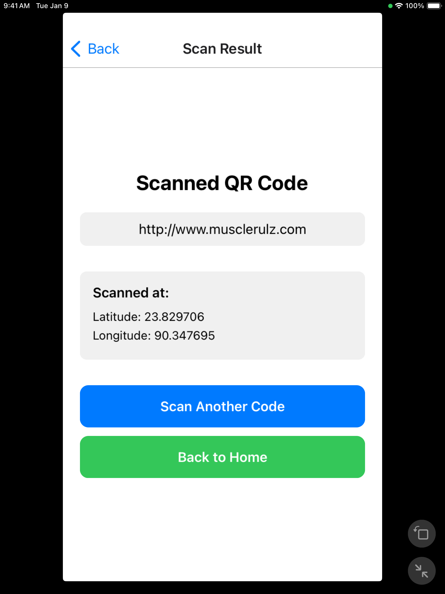

# EasyQR

EasyQR is a powerful and easy-to-use QR code scanning application. It is designed to scan QR codes quickly and efficiently while also capturing the user's location during the scanning process. This app is built using React Native and leverages the `react-native-vision-camera` and `@react-native-community/geolocation` libraries to provide a seamless experience on both Android and iOS platforms.

## Features

- **QR Code Scanning**: EasyQR can scan QR codes with high accuracy and speed.
- **Location Capture**: While scanning a QR code, the app also captures the user's current location (latitude and longitude).
- **Permission Handling**: The app requests necessary permissions for camera and location access.
- **Error Handling**: If location access fails, the app still navigates to the result screen with just the QR code value.

## Screenshots

### Android

<table>
  <tr>
    <td width="33%">
      
      
Home Screen

    </td>
    <td width="33%">
      
      
Camera Screen

    </td>
    <td width="33%">
      
      
Result Screen

    </td>
  </tr>
</table>

### iOS

<table>
  <tr>
    <td width="33%">
      
      
Home Screen

    </td>
    <td width="33%">
      
      
Camera Screen

    </td>
    <td width="33%">
      
      
Result Screen

    </td>
  </tr>
</table>

## How It Works

1. **Permission Request**: Permissions for corresponding tasks are checked and if not available asked for before trying to execute the tasks.
2. **QR Code Scanning**: The app uses the device's camera to scan QR codes. The `useCodeScanner` hook from `react-native-vision-camera` is used to handle the scanning process.
3. **Location Capture**: Upon successfully scanning a QR code, the app requests the user's current location using the `Geolocation` API from `@react-native-community/geolocation`.
4. **Navigation**: After obtaining the QR code value and location, the app navigates to the result screen, passing the scanned value and location data.

## Contributing

We welcome contributions to improve EasyQR! If you have any suggestions or find any issues, please open an issue or submit a pull request.

## License

This project is licensed under the MIT License - see the [LICENSE](LICENSE) file for details.
